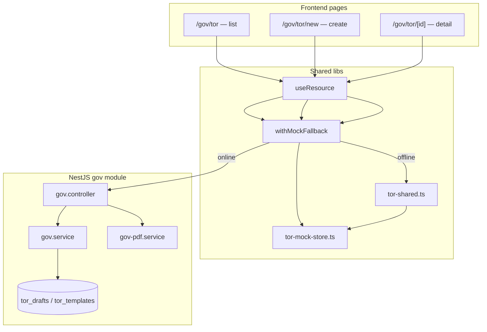

# GoV ToR Module — Architecture

Government **Terms of Reference (ToR / เอกสารขอบเขตของงาน)** drafting for Thai procurement workflows.

## Overview

| Layer | Location | Role |
|---|---|---|
| API | `backend/src/modules/gov/` | Templates, AI draft generation, status workflow, PDF export |
| Pages | `frontend/app/gov/tor/` | List, create, detail (edit / advance / export) |
| Shared mocks | `frontend/lib/tor-shared.ts` | Single source for offline mock data + checklist helpers |
| Session store | `frontend/lib/tor-mock-store.ts` | `sessionStorage` merge for offline create/advance/edit |
| API client | `frontend/lib/api.ts` | `gov.list`, `templates`, `createDraft`, `getDraft`, `updateDraft`, `advanceStatus` |
| i18n | `frontend/lib/i18n/dictionary.ts` | `tor.*` keys (8 locales) |
| Schema | `database/phase2_gov_schema.sql` | `tor_templates`, `tor_drafts` |

## Request flow



## Data fetching pattern

All three pages use the standard NirvaProcure pattern:

```ts
useResource(() => withMockFallback(() => govApi.<method>(), <mock>))
```

- **Online**: UUID draft IDs hit the NestJS API with org-scoped RLS.
- **Offline**: string mock IDs (`tor-1`, `tor-2`, …) resolve from `tor-shared.ts`, merged with `sessionStorage` via `tor-mock-store.ts`.

## Status workflow

```
draft → review → approved → archived
```

| DB status | List UI label |
|---|---|
| `draft` | draft |
| `review` | review |
| `approved` | approved |
| `archived` | published |

Body editing is allowed only in `draft` and `review`.

## Compliance checklist

Six items evaluated at create time from the brief (`runBriefChecklist` / `gov.service.runChecklist`):

| Key | Rule (simplified) |
|---|---|
| `has_scope` | scope text > 30 chars |
| `has_budget` | budget_minor > 0 |
| `has_deliverables` | at least one deliverable |
| `has_evaluation_method` | method selected |
| `has_timeline` | start + end dates |
| `has_qualifications` | required for construction only |

On **body PATCH**, `has_timeline` is re-evaluated from markdown via `patchChecklistFromBody` (frontend mock store + backend service) when the item is not `na`.

## File map

```
backend/src/modules/gov/
├── gov.controller.ts   REST routes
├── gov.service.ts      Business logic, AI draft, checklist, advance
├── gov-pdf.service.ts  pdfkit stream for GET .../pdf
└── gov.module.ts

frontend/app/gov/tor/
├── page.tsx            List: search, status/kind filters, sort, refresh on revisit
├── new/page.tsx        Template picker, brief form, live checklist, create
└── [id]/page.tsx       Detail: advance, copy/download/print/PDF, inline edit, banner

frontend/lib/
├── tor-shared.ts       MOCK_TOR_* constants, label keys, checklist helpers, sortTorList
├── tor-mock-store.ts   sessionStorage persistence for offline flows
└── api.ts              gov.* client methods
```

## API endpoints

| Method | Path | Purpose |
|---|---|---|
| GET | `/gov/tor/templates` | Official + custom templates |
| GET | `/gov/tor/drafts` | Org draft list |
| POST | `/gov/tor/drafts` | Create draft (AI body + checklist) |
| GET | `/gov/tor/drafts/:id` | Draft detail |
| PATCH | `/gov/tor/drafts/:id` | Update `body_markdown` (+ checklist refresh) |
| POST | `/gov/tor/drafts/:id/advance` | Move to next status |
| GET | `/gov/tor/drafts/:id/pdf` | PDF download (UUID drafts only in UI) |

## Tests

- `frontend/e2e/gov-tor.spec.ts` — list filters, create, detail actions, edit, checklist banner
- `scripts/smoke.sh` — templates, drafts, PDF, PATCH, advance against live API
