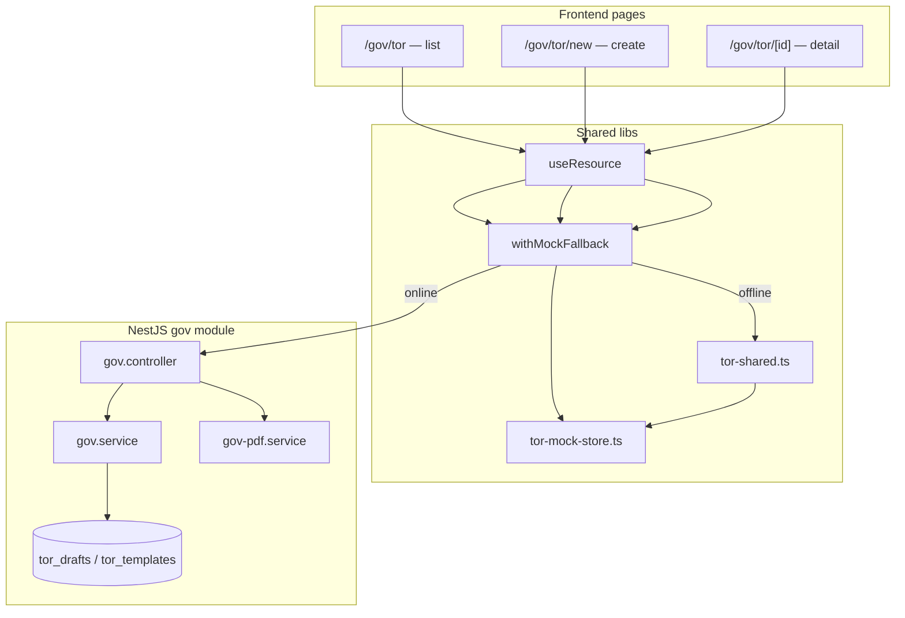

# GoV ToR Module — Architecture

Government **Terms of Reference (ToR / เอกสารขอบเขตของงาน)** drafting for Thai procurement workflows.

## Overview

| Layer | Location | Role |
|---|---|---|
| API | `backend/src/modules/gov/` | Templates, AI draft generation, status workflow, PDF export |
| Pages | `frontend/app/gov/tor/` | List, create, detail (edit / advance / export) |
| Shared mocks | `frontend/lib/tor-shared.ts` | Single source for offline mock data + checklist helpers |
| Session store | `frontend/lib/tor-mock-store.ts` | `sessionStorage` merge for offline create/advance/edit |
| API client | `frontend/lib/api.ts` | `gov.list`, `templates`, `createTemplate`, `deleteTemplate`, `createDraft`, `getDraft`, `updateDraft`, `advanceStatus` |
| i18n | `frontend/lib/i18n/dictionary.ts` | `tor.*` keys (8 locales) |
| Schema | `database/phase2_gov_schema.sql` | `tor_templates`, `tor_drafts` |

## Request flow



## Data fetching pattern

All three pages use the standard NirvaProcure pattern:

```ts
useResource(() => withMockFallback(() => govApi.<method>(), <mock>))
```

- **Online**: UUID draft IDs hit the NestJS API with org-scoped RLS.
- **Offline**: string mock IDs (`tor-1`, `tor-2`, …) resolve from `tor-shared.ts`, merged with `sessionStorage` via `tor-mock-store.ts`.

## Status workflow

```
draft → review → approved → archived
         ↑
    send back (revert)
```

| Transition | Endpoint |
|---|---|
| Forward | `POST .../advance` |
| Send back | `POST .../revert` (review → draft only) |

| DB status | List UI label |
|---|---|
| `draft` | draft |
| `review` | review |
| `approved` | approved |
| `archived` | published |

Body editing is allowed only in `draft` and `review`.

## Compliance checklist

Six items evaluated at create time from the brief (`runBriefChecklist` / `gov.service.runChecklist`):

| Key | Rule (simplified) |
|---|---|
| `has_scope` | scope text > 30 chars |
| `has_budget` | budget_minor > 0 |
| `has_deliverables` | at least one deliverable |
| `has_evaluation_method` | method selected |
| `has_timeline` | start + end dates |
| `has_qualifications` | required for construction only |

On **body PATCH**, non-`na` checklist rows are re-scanned from markdown via `scanChecklistFromBody` / `patchChecklistFromBody` (frontend `tor-shared.ts` + backend `gov.service`). Rules mirror the brief checks using keyword heuristics (scope length, budget/timeline/deliverable/evaluation keywords). `has_qualifications` only updates when `brief_json.procurement_kind` is `construction`.

## Offline mock storage (`sessionStorage`)

Exported as `TOR_MOCK_STORAGE` in `tor-mock-store.ts`:

| Key | Purpose |
|---|---|
| `tor-mock:{id}` | Persisted draft JSON after create/edit/advance |
| `tor-mock-list` | Extra list rows from offline create |
| `tor-mock-status-overrides` | List status overrides after advance on seeded mocks |
| `tor-mock-pr:{id}` | Linked PR id/number after create-pr from approved ToR |
| `tor-mock-custom-templates` | Org templates created offline (merged into template list/picker) |

`mergeMockTorList(MOCK_TOR_LIST)` applies overrides and prepends session-created rows before the API/mock base list. `mergeMockTorTemplates(MOCK_TOR_TEMPLATES)` prepends session-created custom templates.

## Seed data vs frontend mocks

| Surface | ID pattern | Example |
|---|---|---|
| Frontend offline | string slug | `tor-1`, `tor-2`, `tor-3` |
| Database seed | UUID | `99999999-…-901` (draft), `88888888-…-801` (template) |

Titles and checklist states are aligned between `MOCK_TOR_*` and `database/seed.sql` so smoke/e2e and a live DB show the same sample projects. UUID drafts enable backend PDF; slug mocks stay client-only.

## Online vs offline routing

- `TOR_UUID_RE.test(id)` → backend PDF link, live PATCH/advance
- Non-UUID ids → `mockTorDraft(id, readMockTorDraft(id))` only; print/copy/download still work

## PR merge stack (Phases 19–28)

Merge in order onto `main` (each PR targets the previous phase branch):

`#50` → … → `#72` → Phase 31

## Cross-module links

| Direction | Mechanism |
|---|---|
| ToR → PR | `POST .../create-pr` sets `tor_drafts.linked_pr_id` |
| PR → ToR | `GET /pr/:id` returns `linked_tor` (by `linked_pr_id` or item `source_metadata.tor_draft_id`) |

Or squash the stack into one release PR after final review.

## Shared UI constants (`tor-shared.ts`)

| Export | Used by |
|---|---|
| `TOR_KIND_LABEL_KEYS` | list, new, detail kind badges |
| `TOR_CHECKLIST_LABEL_KEYS` | new, detail checklist |
| `TOR_LIST_STATUS_STYLE` | list cards |
| `TOR_DETAIL_STATUS_*` | detail status badge + advance labels |
| `TOR_REVERT_LABEL_KEYS` | send-back button (review only) |

## File map

```
backend/src/modules/gov/
├── gov.controller.ts   REST routes
├── gov.service.ts      Business logic, AI draft, checklist, advance
├── gov-pdf.service.ts  pdfkit stream for GET .../pdf
└── gov.module.ts

frontend/app/gov/tor/
├── page.tsx            List: search, status/kind filters, sort, refresh on revisit
├── templates/page.tsx  Template library browser (official + org templates, delete custom)
├── templates/new/      Create org template form
├── new/page.tsx        Template picker, brief form, live checklist, create
└── [id]/page.tsx       Detail: advance, copy/download/print/PDF, inline edit, banner

frontend/lib/
├── tor-shared.ts       MOCK_TOR_* constants, label keys, checklist helpers, sortTorList
├── tor-mock-store.ts   sessionStorage persistence for offline flows
└── api.ts              gov.* client methods
```

## API endpoints

| Method | Path | Purpose |
|---|---|---|
| GET | `/gov/tor/templates` | Official + custom templates |
| POST | `/gov/tor/templates` | Create org template (`is_official: false`) |
| DELETE | `/gov/tor/templates/:id` | Soft-delete custom template (blocks official) |
| GET | `/gov/tor/drafts` | Org draft list |
| POST | `/gov/tor/drafts` | Create draft (AI body + checklist) |
| GET | `/gov/tor/drafts/:id` | Draft detail |
| PATCH | `/gov/tor/drafts/:id` | Update `body_markdown` (+ checklist refresh) |
| POST | `/gov/tor/drafts/:id/advance` | Move to next status |
| POST | `/gov/tor/drafts/:id/revert` | Send back (review → draft) |
| POST | `/gov/tor/drafts/:id/create-pr` | Create PR from approved ToR (sets `linked_pr_id`) |
| GET | `/gov/tor/drafts/:id/pdf` | PDF download (UUID drafts only in UI) |

## Tests

- `frontend/lib/tor-shared.test.ts` — unit tests for checklist scan/patch + sort
- `frontend/e2e/gov-tor.spec.ts` — list filters, create, detail actions, edit, checklist banner
- `scripts/smoke.sh` — templates, drafts, PDF, PATCH (asserts `has_timeline`), advance against live API
