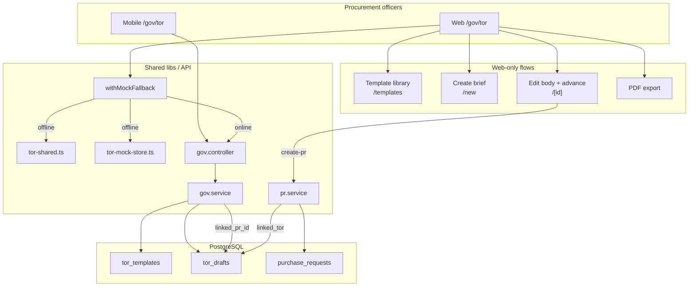

# GoV ToR Module — Architecture (full include)

Government **Terms of Reference (ToR / เอกสารขอบเขตของงาน)** for Thai public procurement — one module, no artificial boundaries between web, mobile, API, PR, templates, and offline mocks.

This document is the **single include** for everything ToR-related. Prefer linking here from `STATUS.md`, PR bodies, and onboarding notes instead of duplicating phase notes.

---

## Included scope (what this module owns)

| Surface | Included | Not included (yet) |
|---|---|---|
| **Web** (`frontend/app/gov/tor/`) | List, create, detail, templates CRUD, offline mocks, e2e | Multi-org admin, bulk import |
| **Mobile** (`mobile/lib/pages/tor_*`) | List + detail (read-only), linked PR navigation | Create, advance, edit on device |
| **API** (`backend/src/modules/gov/`) | Templates, drafts, AI body, checklist, workflow, PDF, create-pr | Public portal, supplier-facing ToR |
| **PR module** (`pr.service`) | `linked_tor` on PR detail, `create-pr` from ToR | Auto-sync PR line items on ToR edit |
| **Database** | `tor_templates`, `tor_drafts`, `linked_pr_id` | Version history table |
| **i18n** | `tor.*` (web 8 locales), `tor.*` + `more.tor` (mobile 8 locales) | Email templates for ToR events |
| **Tests** | vitest, e2e (30), smoke (17 steps incl. full ToR path) | Load tests |
| **Docs** | This file | Per-phase READMEs |

---

## Overview

| Layer | Location | Role |
|---|---|---|
| API | `backend/src/modules/gov/` | Templates, AI draft, status workflow, PDF, PR bridge |
| Web pages | `frontend/app/gov/tor/` | Full officer workflow (draft → PR) |
| Mobile pages | `mobile/lib/pages/tor_*.dart` | Field read + linked PR drill-in |
| Shared mocks | `frontend/lib/tor-shared.ts` | Offline data + checklist helpers |
| Session store | `frontend/lib/tor-mock-store.ts` | `sessionStorage` for offline flows |
| API clients | `frontend/lib/api.ts`, `mobile/lib/api/endpoints.dart` | Typed `gov.*` / `Api.listTorDrafts` |
| i18n | `frontend/lib/i18n/dictionary.ts`, `mobile/lib/l10n/dictionary.dart` | 8 locales |
| Schema | `database/phase2_gov_schema.sql`, `phase2_gov_pr_link.sql` | Tables + `linked_pr_id` |

---

## End-to-end flow (all surfaces)



---

## Data fetching pattern (web)

```ts
useResource(() => withMockFallback(() => govApi.<method>(), <mock>))
```

- **Online**: UUID draft IDs → NestJS + org RLS.
- **Offline**: slug IDs (`tor-1`, …) → `tor-shared.ts` + `tor-mock-store.ts` merge.

Mobile calls the API directly (no mock fallback); requires live backend or shows error.

---

## Status workflow

```
draft → review → approved → archived
         ↑
    send back (revert)
```

| Transition | Endpoint | Web | Mobile |
|---|---|---|---|
| Forward | `POST .../advance` | ✅ | — |
| Send back | `POST .../revert` | ✅ | — |
| Create PR | `POST .../create-pr` | ✅ | — (view link only) |

| DB status | List UI label |
|---|---|
| `draft` | draft |
| `review` | review |
| `approved` | approved |
| `archived` | published |

Body editing allowed only in `draft` and `review` (web).

---

## Compliance checklist

Six items at create (`runBriefChecklist` / `gov.service.runChecklist`):

| Key | Rule (simplified) |
|---|---|
| `has_scope` | scope text > 30 chars |
| `has_budget` | budget_minor > 0 |
| `has_deliverables` | at least one deliverable |
| `has_evaluation_method` | method selected |
| `has_timeline` | start + end dates |
| `has_qualifications` | required for construction only |

On **body PATCH**, non-`na` rows refresh via `scanChecklistFromBody` / `patchChecklistFromBody` (frontend + backend). `has_qualifications` only updates when `brief_json.procurement_kind` is `construction`.

---

## Cross-module links (ToR ↔ PR)

| Direction | Mechanism | UI |
|---|---|---|
| ToR → PR | `POST .../create-pr` sets `tor_drafts.linked_pr_id` | Web: linked PR card + list badge; Mobile: badge + card → `/pr/:id` |
| PR → ToR | `GET /pr/:id` returns `linked_tor` | Web PR detail card → `/gov/tor/:id` |
| List API | `GET /gov/tor/drafts` includes `linked_pr_id`, `linked_pr_number` | Web + mobile list badges |

---

## Offline mock storage (`sessionStorage`)

`TOR_MOCK_STORAGE` in `tor-mock-store.ts`:

| Key | Purpose |
|---|---|
| `tor-mock:{id}` | Draft JSON after create/edit/advance |
| `tor-mock-list` | Extra list rows from offline create |
| `tor-mock-status-overrides` | List status after advance on seeded mocks |
| `tor-mock-pr:{id}` | Linked PR after create-pr |
| `tor-mock-custom-templates` | Org templates (merged into list/picker) |

Helpers: `mergeMockTorList`, `mergeMockTorTemplates`, `mergeMockTorPrLink`.

---

## Seed data vs frontend mocks

| Surface | ID pattern | Example |
|---|---|---|
| Frontend offline | string slug | `tor-1`, `tor-2`, `tor-3` |
| Database seed | UUID | `99999999-…-901` (draft), `88888888-…-801` (template) |
| Custom template (offline) | `tpl-custom-{ts}` | Created in browser session |

Aligned with `database/seed.sql` for smoke/e2e parity.

---

## Online vs offline routing (web)

- `TOR_UUID_RE.test(id)` → live API, PDF download
- Non-UUID → `mockTorDraft(id, readMockTorDraft(id))`; print/copy/download still work

---

## Phase delivery log (PR stack → #77)

Merge in order onto `main` (each PR targets the previous phase branch), or **squash into one release PR**:

| Phase | PR | Highlights |
|---|---|---|
| 18 | #50 | Audit + initial Gov ToR |
| 24 | — | PDF export + list refresh |
| 25 | — | Inline body edit |
| 26 | — | List search/filter/sort |
| 27 | #69 | `tor-shared.ts`, `GOV_TOR.md` |
| 28 | #70 | Checklist scan/patch, expanded tests |
| 29 | #71 | Revert workflow (review → draft) |
| 30 | #72 | `create-pr`, `linked_pr_id` |
| 31 | #73 | PR `linked_tor` card, template library page |
| 32 | #74 | Template CRUD (POST/DELETE) |
| 33 | #75 | Template edit (GET/PATCH) |
| 34 | #76 | Linked PR badge (list + detail) |
| 35 | #77 | Flutter list + detail |

**Squash target:** `cursor/phase35-flutter-gov-tor-87fc` (or latest phase branch) → single PR to `main`.

---

## Shared UI constants (`tor-shared.ts`)

| Export | Used by |
|---|---|
| `MOCK_TOR_*` | All web pages + e2e |
| `TOR_KIND_LABEL_KEYS` | list, new, templates, detail |
| `TOR_CHECKLIST_LABEL_KEYS` | new, detail |
| `TOR_LIST_STATUS_STYLE` | list cards |
| `TOR_DETAIL_STATUS_*` | detail badge + advance |
| `TOR_REVERT_LABEL_KEYS` | send-back (review only) |
| `buildPrPayloadFromTor` | create-pr (web mock + backend) |
| `sortTorList` | list ordering |

---

## File map (full include)

```
backend/src/modules/gov/
├── gov.controller.ts    REST routes
├── gov.service.ts       Business logic, AI, checklist, advance, templates, create-pr
├── gov-pdf.service.ts   pdfkit for GET .../pdf
└── gov.module.ts

database/
├── phase2_gov_schema.sql      tor_templates, tor_drafts
└── phase2_gov_pr_link.sql     tor_drafts.linked_pr_id → purchase_requests

frontend/app/gov/tor/
├── page.tsx                   List: search, filters, sort, linked PR badge
├── new/page.tsx               Template picker, brief, live checklist, create
├── [id]/page.tsx              Detail: advance, revert, edit, export, create-pr, linked PR card
└── templates/
    ├── page.tsx               Library: official + custom, edit/delete
    ├── new/page.tsx           Create org template
    └── [id]/edit/page.tsx     Edit org template

frontend/lib/
├── tor-shared.ts              Mocks, checklist, labels, sort
├── tor-mock-store.ts          sessionStorage merges
└── api.ts                     gov.*

mobile/lib/
├── pages/tor_list_page.dart   List + filters + linked PR badge + FAB → create
├── pages/tor_create_page.dart Create draft (template, brief, AI body)
├── pages/tor_detail_page.dart Detail + checklist + linked PR card + workflow actions
└── api/endpoints.dart         TorTemplate, TorListItem, TorDraft, list/get/create/advance/revert API

frontend/e2e/gov-tor.spec.ts   30 scenarios (offline mock fallback)
frontend/lib/tor-shared.test.ts
scripts/smoke.sh               Steps 10–15: full ToR API path
```

---

## API endpoints (complete)

| Method | Path | Purpose |
|---|---|---|
| GET | `/gov/tor/templates` | Official + custom templates |
| GET | `/gov/tor/templates/:id` | Template detail + `body_markdown` |
| POST | `/gov/tor/templates` | Create org template |
| PATCH | `/gov/tor/templates/:id` | Update custom template |
| DELETE | `/gov/tor/templates/:id` | Soft-delete custom template |
| GET | `/gov/tor/drafts` | List (+ `linked_pr_id` / `linked_pr_number`) |
| POST | `/gov/tor/drafts` | Create draft (AI body + checklist) |
| GET | `/gov/tor/drafts/:id` | Draft detail |
| PATCH | `/gov/tor/drafts/:id` | Update `body_markdown` (+ checklist refresh) |
| POST | `/gov/tor/drafts/:id/advance` | Next status |
| POST | `/gov/tor/drafts/:id/revert` | Send back (review → draft) |
| POST | `/gov/tor/drafts/:id/create-pr` | Create PR from approved ToR |
| GET | `/gov/tor/drafts/:id/pdf` | PDF (UUID drafts; web UI) |
| GET | `/pr/:id` | PR detail incl. `linked_tor` when applicable |

---

## i18n key families

| Prefix | Web | Mobile | Examples |
|---|---|---|---|
| `tor.list.*` | ✅ | ✅ | heading, empty, search |
| `tor.status.*` | ✅ | ✅ | draft, review, approved, published |
| `tor.kind.*` | ✅ | ✅ | goods, services, construction |
| `tor.templates.*` | ✅ | — | create, edit, save, delete |
| `tor.linked_pr.*` | ✅ | ✅ | badge, title, view |
| `tor.action.*` | ✅ | ✅ | submit_review, approve, send_back, archive |
| `tor.checklist.*` | ✅ | ✅ | title, per-item labels, hint |
| `tor.create.*` / form keys | ✅ | ✅ | heading, template, scope, cta |
| `pr.linked_tor.*` | ✅ | — | PR detail back-link to ToR |
| `more.tor` | — | ✅ | More tab tile |

---

## Tests included

| Suite | Path | Coverage |
|---|---|---|
| Unit | `frontend/lib/tor-shared.test.ts` | checklist scan/patch, sort |
| E2E | `frontend/e2e/gov-tor.spec.ts` | 30 tests — list, create, templates, create-pr, linked badge |
| Smoke | `scripts/smoke.sh` §10–15 | templates CRUD, drafts, PDF, PATCH, advance, revert, create-pr, list `linked_pr` |
| Mobile | manual | list, create, detail workflow (advance/revert) against live API |

### Phase 37 — Mobile create ToR (`cursor/phase37-mobile-tor-create-87fc`) — PR [#80](https://github.com/Nirvacore/Nirvaprocure/pull/80)

- `POST /gov/tor/drafts` from Flutter (`Api.createTorDraft`)
- `GET /gov/tor/templates` for optional template picker
- Route `/gov/tor/new` (registered before `/gov/tor/:id`)
- FAB on list → create form → navigate to detail on success
- 26 new i18n keys × 8 locales in `mobile/lib/l10n/dictionary.dart`

### Phase 38 — Mobile advance/revert (`cursor/phase38-mobile-tor-advance-87fc`) — PR [#81](https://github.com/Nirvacore/Nirvaprocure/pull/81)

- `POST .../advance` + `POST .../revert` (`Api.advanceTorDraft`, `Api.revertTorDraft`)
- Bottom action bar on `TorDetailPage`: draft→review, review→approve/send back, approved→archive
- Checklist rows use `tor.checklist.*` labels (not raw keys)
- 11 new i18n keys × 8 locales (`tor.action.*`, `tor.toast.status`, checklist items)

---

## Horizon (intentionally out of scope for now)

- Mobile: create PR from ToR, template admin
- ToR version history / diff view
- Supplier portal read-only ToR publish
- Webhook events: `tor.status_changed`, `tor.pr_linked`
- Squash-merge PR stack `#50–#77` into `main` (ops task)

When adding features, extend this doc first — keep one boundary-less include.
